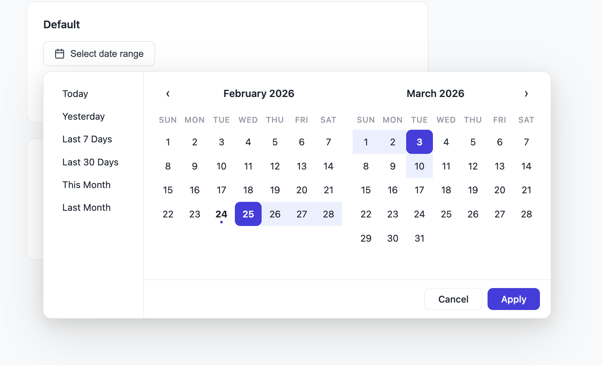

# TwoCal

[](https://www.npmjs.com/package/twocal)
[](./LICENSE)
[](https://www.typescriptlang.org/)

Framework-agnostic vibe-coded date range picker with dual calendars, presets, and theming.



## Features

- Dual side-by-side calendar layout
- Built-in preset ranges (Today, Last 7 Days, Last Month, etc.)
- Full keyboard navigation (arrow keys, Home/End, Page Up/Down) and ARIA support
- Customizable theming via CSS custom properties
- Locale-aware formatting via `Intl` API
- Zero dependencies — vanilla TypeScript, works with any framework

## Install

```bash
npm install twocal
```

## Quick Start

```html
<button id="pick-dates">Select date range</button>
```

```typescript
import { TwoCal } from 'twocal';

const picker = new TwoCal({
  trigger: document.getElementById('pick-dates')!,
  onRangeSelect: (range) => {
    console.log(range.start); // { year: 2026, month: 2, day: 10 }
    console.log(range.end);   // { year: 2026, month: 2, day: 20 }
  },
});
```

## Options

All options passed to the `TwoCal` constructor:

| Option | Type | Default | Description |
|--------|------|---------|-------------|
| `trigger` | `HTMLElement` | — | **Required.** Element that opens the picker on click. |
| `onRangeSelect` | `(range: DateRange) => void` | — | **Required.** Called when the user applies a range. |
| `onOpen` | `() => void` | — | Called when the picker opens. |
| `onClose` | `() => void` | — | Called when the picker closes. |
| `presets` | `PresetRange[]` | 6 built-in presets | Custom preset ranges shown in the sidebar. |
| `theme` | `TwoCalTheme` | Default indigo theme | Color and style overrides. |
| `initialRange` | `DateRange` | — | Pre-selected date range. |
| `minDate` | `CalendarDate` | — | Earliest selectable date. |
| `maxDate` | `CalendarDate` | — | Latest selectable date. |
| `placement` | `'bottom' \| 'top'` | `'bottom'` | Popup position relative to trigger. Flips automatically if clipped. |
| `firstDayOfWeek` | `0 \| 1` | `0` | `0` = Sunday, `1` = Monday. |
| `locale` | `string` | `'en-US'` | BCP 47 locale for month/day names and formatting. |
| `container` | `HTMLElement` | `document.body` | Parent element for the popup. |

## Supported Languages

Built-in translations for UI strings (presets, buttons, ARIA labels):

| Language | Locale examples | RTL |
|----------|----------------|-----|
| English | `en-US`, `en-GB` | No |
| Chinese | `zh-CN`, `zh-TW` | No |
| Hindi | `hi-IN` | No |
| Spanish | `es-ES`, `es-MX` | No |
| French | `fr-FR`, `fr-CA` | No |
| Portuguese | `pt-BR`, `pt-PT` | No |
| German | `de-DE`, `de-AT` | No |
| Russian | `ru-RU` | No |
| Japanese | `ja-JP` | No |
| Arabic | `ar-SA`, `ar-EG` | Yes |

Any locale not listed above falls back to English. You can override individual strings via the `translations` option:

```typescript
new TwoCal({
  trigger,
  onRangeSelect,
  locale: 'de-DE',
  translations: {
    cancel: 'Abbrechen',
    apply: 'Übernehmen',
  },
});
```

## Keyboard Navigation

The picker is fully operable via keyboard, meeting WCAG 2.1 AA requirements:

| Key | Action |
|-----|--------|
| `Arrow Left` / `Arrow Right` | Move focus by one day |
| `Arrow Up` / `Arrow Down` | Move focus by one week |
| `Home` / `End` | Jump to first / last day of the month |
| `Page Up` / `Page Down` | Move focus to the same day in the previous / next month |
| `Enter` / `Space` | Select the focused date |
| `Escape` | Close the picker |
| `Tab` / `Shift+Tab` | Move between presets, calendar grid, and footer buttons (focus is trapped within the dialog) |

When arrow keys or page keys move focus beyond the visible calendars, the view auto-scrolls. Disabled dates (outside `minDate`/`maxDate`) are automatically skipped.

## Methods

| Method | Description |
|--------|-------------|
| `open()` | Opens the picker programmatically. |
| `close()` | Closes the picker (reverts uncommitted selection). |
| `getRange(): DateRange \| null` | Returns the currently applied range. |
| `setRange(range: DateRange)` | Sets the range programmatically. |
| `setTheme(theme: TwoCalTheme)` | Replaces the theme at runtime. |
| `destroy()` | Removes all DOM elements and event listeners. |

## Theming

Pass a partial `TwoCalTheme` to override any default value:

```typescript
new TwoCal({
  trigger,
  onRangeSelect: (range) => { /* ... */ },
  theme: {
    primaryColor: '#e11d48',
    primaryHoverColor: '#be123c',
    rangeHighlightColor: '#fff1f2',
    borderRadius: '16px',
  },
  firstDayOfWeek: 1,
});
```

| Property | Default |
|----------|---------|
| `primaryColor` | `#4f46e5` |
| `primaryHoverColor` | `#4338ca` |
| `backgroundColor` | `#ffffff` |
| `textColor` | `#1f2937` |
| `textMutedColor` | `#9ca3af` |
| `borderColor` | `#e5e7eb` |
| `borderRadius` | `12px` |
| `rangeHighlightColor` | `#eef2ff` |
| `fontFamily` | System font stack |
| `fontSize` | `14px` |
| `zIndex` | `9999` |

## Custom Presets

Replace or extend the default sidebar presets:

```typescript
import { TwoCal, createCalendarDate, today } from 'twocal';
import type { PresetRange } from 'twocal';

const presets: PresetRange[] = [
  {
    label: 'This Week',
    range: () => {
      const t = today();
      const dayOfWeek = new Date(t.year, t.month - 1, t.day).getDay();
      return {
        start: createCalendarDate(t.year, t.month, t.day - dayOfWeek),
        end: t,
      };
    },
  },
];

new TwoCal({ trigger, onRangeSelect, presets });
```

Pass an empty array to hide the sidebar entirely.

## Types

All types are exported for use in your application:

```typescript
import type {
  TwoCalOptions,
  TwoCalTheme,
  DateRange,
  CalendarDate,
  PresetRange,
  Placement,
} from 'twocal';
```

`CalendarDate` uses 1-indexed months: `{ year: 2026, month: 1, day: 15 }` is January 15, 2026.

## Demo

Clone the repo and start the Vite dev server:

```bash
git clone https://github.com/sergiobayona/twocal.git
cd twocal
npm install
npm run dev
```

Open the URL printed in the terminal (usually `http://localhost:5173`). The demo includes a default picker and a custom-themed picker with Monday start.

## License

MIT

